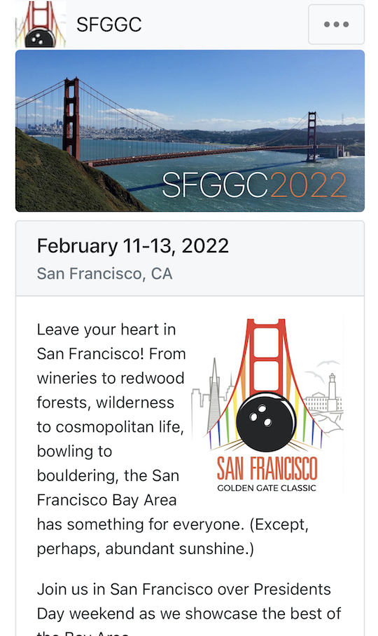
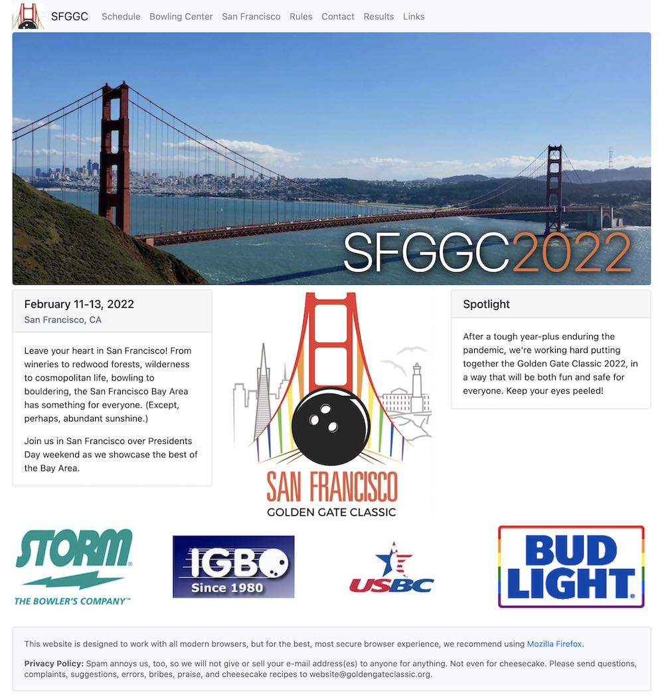

# Golden Gate Classic website

This is the informational website for the Golden Gate Classic, an IGBO-affiliated bowling tournament. The site is available at [www.goldengateclassic.org](http://www.goldengateclassic.org).

It's built as a static website using the [Next.js](https://nextjs.org/) framework and [React-Bootstrap](https://react-bootstrap.github.io/).

It uses Bootstrap 4, so it's built for mobile-first.

### Mobile

  

### Desktop

  

## Development & local running

1. Clone this repository
2. Install [Node.js](https://nodejs.org/en/)
3. Run `npm install`
4. To run a development server, run `npm run dev` and have at it!

## Contributing
Pull requests are welcome. For major changes, please open an issue first to discuss what you would like to change.

Please make sure to update tests as appropriate.

## License
[MIT](https://choosealicense.com/licenses/mit/)
